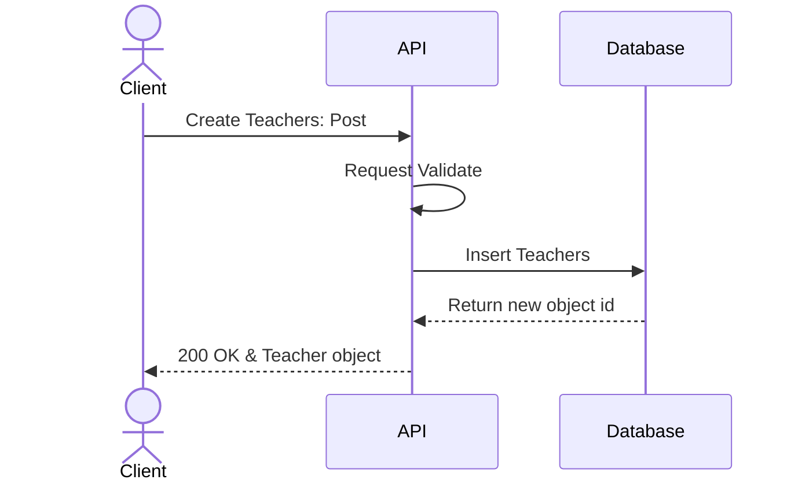
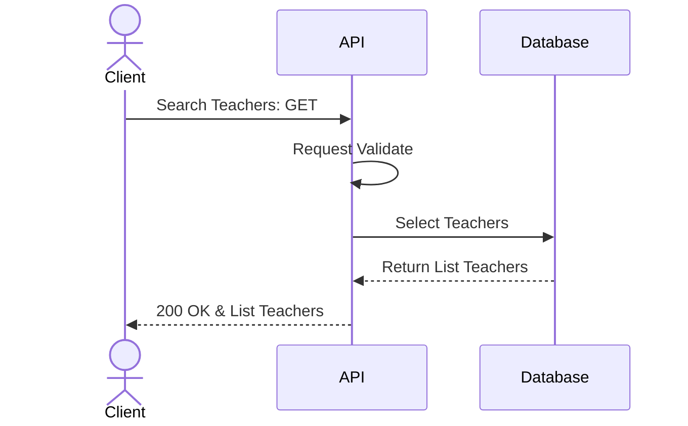
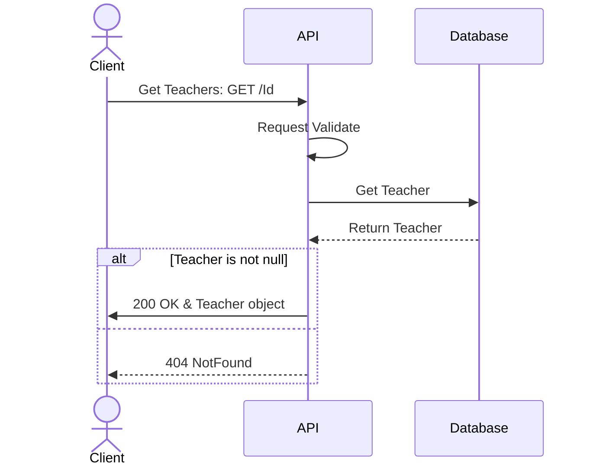

# CriEduc School API
Project created to support learning in observability.

### Digram

#### Create Teacher 

```mermaid
sequenceDiagram
    Actor Client
    participant API
    participant Database
    Client->>API: Create Teachers: Post
    API->>API: Request Validate
    API->>Database: Insert Teachers
    Database-->>API: Return new object id
    API-->>Client: 200 OK & Teacher object   
```

#### Search Teacher

```mermaid
sequenceDiagram
    Actor Client
    participant API
    participant Database
    Client->>API: Search Teachers: GET
    API->>API: Request Validate
    API->>Database: Select Teachers
    Database-->>API: Return List Teachers
    API-->>Client: 200 OK & List Teachers   
```

#### Get Teacher

```mermaid
sequenceDiagram
    Actor Client
    participant API
    participant Database
    Client->>API: Get Teachers: GET /Id
    API->>API: Request Validate
    API->>Database: Get Teacher
    Database-->>API: Return Teacher
    alt Teacher is not null
        API->>Client: 200 OK & Teacher object      
    else 
        API-->>Client: 404 NotFound
    end
```

